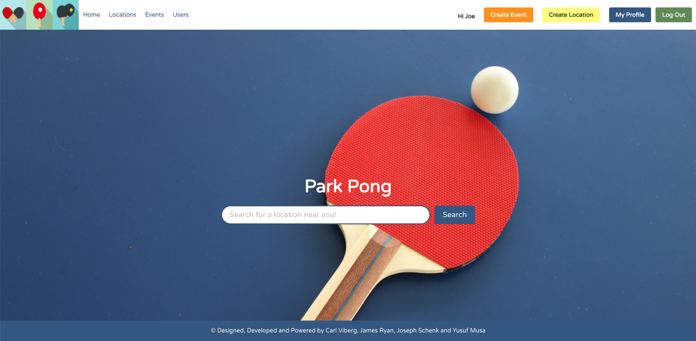

### General Assembly Software Engineering Immersive

#Project 3: Park Pong



## The Overview:

The project set by General Assembly was fairly open - as a group of four we were tasked with creating a full stack application using MERN - Mongoose, Express, React and Node. 

We decided to create a Ping Pong table finding website, where users could create profiles and then create locations of free ping pong tables. Furthermore, they could set up events at different locations, see all the locations created by all users, and interact with other users by writing on their message boards. 

You can check out the website here: [](https://park-pong.herokuapp.com/)

### The Brief

We were given the following brief:

You must:

* Work in a team, using **git to code collaboratively**.
* **Build a full-stack application** by making your own backend and your own front-end
* **Use an Express API** to serve your data from a Mongo database
* **Consume your API with a separate front-end** built with React
* **Be a complete product** which most likely means multiple relationships and CRUD functionality for at least a couple of models
* **Implement thoughtful user stories/wireframes** that are significant enough to help you know which features are core MVP and which you can cut
* **Have a visually impressive design** to kick your portfolio up a notch and have something to wow future clients & employers. **ALLOW** time for this.
* **Be deployed online** so it's publicly accessible.
* **Have automated tests** for _at least_ one RESTful resource on the back-end. Improve your employability by demonstrating a good understanding of testing principals.

The necessary deliverables are:

* A **working app** hosted on the internet
* A **link to your hosted working app** in the URL section of your Github repo
* A **git repository hosted on Github**, with a link to your hosted project, and frequent commits dating back to the _very beginning_ of the project
* **A `readme.md` file**

### Technologies Used:

* HTML5
* CSS3
* ES6
* Git
* Github
* React.js
* Node.js
* Express
* Mongoose
* MongoDB
* Bulma
* Axios
* Nodemon
* SASS/SCSS
* Bcrypt
* jsonwebtoken
* React Mapbox GL
* Nodemailer
* Mocha
* Chai

### Planning:

Knowing that we would have to be careful to avoid difficult to resolve merge conflicts along with wanting to manage our time as well as possible given the short deadline, we wanted to be as thorough at planning as possible. 

Using whiteboarding techniques, we started by planning the user story.


This gave us the ability to think about the application as a whole, in terms of what we wanted it to do and how. 

After this, we planned the necessary components of the back end, including which models to make, which views we needed and which controllers were necessary. We then split these up and each worked on a part of the back end.


Once complete, we split up again and wrote a test suite each for our different models. 


Having confirmed the back end worked, we split the front end up into components. To keep track of our naming conventions and file creation, we shared a Google document with all of our file structure in. Next to each file we recorded which functions or variables we needed to export, so that when another team member was writing a file which required them, they new the correct file name to import. 


For each day, Joe wrote a plan of tasks and between us we selected who would do what. This way everyone was clear on what actionable coding they could do, and nobody was ever left without a plan. 

Once the main components were created we came together to plan the overall design of the website and set about how we would create a uniform user experience. 

### Run the web app locally

To run this web app , simply you have to fork the repository, clone it into your machine and cd to the project-3 folder and run the following command

```Javascript
npm install
npm run serve
```
The web app will then run on localhost:8000
​
We hope you enjoy it! 

## The Back-End
​
Having made a clear plan of how to build our back end using the MVC system, we started by focusing on the schemas to ensure the infrastructure was in place, and that the project could be scalable. 

As such, the back end is easily broken up into three parts with their own schemas and endpoints:
​
### Schemas
​
​We used Mongoose to build our schema frameworks, and nested other schemas using MongoDb. 
​
#### Users
​
Our users was in many ways the simplest model in that it only had one nested schema, that being comments. The code looked as follows:
​
```Javascript

const userSchema = new mongoose.Schema({
  username: { type: String, required: true, unique: true },
  email: { type: String, required: true, unique: true },
  password: { type: String, required: [true, 'Password is required'] },
  isAdmin: { type: Boolean },
  //nested schema 
  comments: [commentSchema],
  image: { type: String, required: true },
  bio: { type: String, required: true },
  location: { type: String, required: true }
})
​
```
​We used NPM packages to add security such as
​
```Javascript
Import mongooseHidded from ‘mongoose-hidden
Import cbycrypt from ‘bcrypt 
```
We extended these systems for our locations and events schemas. However, the location schema referenced which user created it, and the events schema had both a user and a location nested within it. 
​
### Views
The views folder contained our router file with the 14 API end points and 29 CRUD operations.

Using express to connect to the database, each route had different requests depending on what was required from that end point. We also used middleware such as a secure route to authenticate whether users were logged in. An example endpoint is shown below.
 
```Javascript
router.route('/user/:id')
 .get(singleUserController.getSingleUser)
 .put(secureRoute, singleUserController.updateSingleUser)
 .delete(secureRoute, singleUserController.deleteSingleUser)
 .post(secureRoute, userComment.createUserComment)
​
```
​
# Controllers
Our controller folder had twelve files for all the different controllers we required, including all users, single user, login, registration etc. 


​
#### Registration

The aim was to make a friendly experience for the user, so rather than have all fields required we validated on crucial fields such as username, email and password. 

Yusuf worked to add a registration confirmation email using NodeMailer: 

```Javascript
const transporter = nodeMailer.createTransport(sendgridTransport({
 auth: {
   api_key: API_KEY
 }
}))
 
async function register(req, res, next) {
 if (req.body.isAdmin) {
   delete req.body.isAdmin
 }
 const body = req.body
 try {
   const user = await User.create(body)
   res.send(
     transporter.sendMail({
       to: body.email,
       from: 'parkpong63@gmail.com',
       subject: 'Registeration successful',
       html: `<h2>Dear ${body.username},</h2> <br><h3> Thank you for your registration with us.</h3>
       
       `
     }))
 } catch (err) {
   next(err)
  }
}
export default {
 register
}
 
```
 
#### User Authentication
​
​We used jsonwebtoken to authenticate users, writing easy and concise code to do so:
​
```Javascript
import jwt from 'jsonwebtoken'
 
async function login(req, res, next) {
 const password = req.body.password
 try {
   const user = await User.findOne({ email: req.body.email })
 
 
   if (!user || !user.validatePassword(password)) {
     return res.status(401).send({ message: 'Unauthorized' })
   
}
 
   const token = jwt.sign(
     { userId: user._id },
     secret,
     { expiresIn: '12h' }
   )
 
   res.status(202).send({ token, message: 'Login successful' })
 } catch (err) {
   next(err)
 }
}

```
​
#### Seeding 

We seeded the database first with User data, then Location data, then Events data. This way each database had the correct nested schemas within it and the seeding would not hit any errors. 

To achieve this, we wrote functions which returned the data when given the nested data.  Here is code which shows the users and location data being passed to a function to create the event data. 
​
```Javascript
export default function getEventData(users, location) {
 return [
   {
     name: 'Ball Busters',
     location: location[0],
     user: users[0],
     image: 'https://images.unsplash.com/photo-1557804500-7a58fbcd4d1a?ixid=MXwxMjA3fDB8MHxwaG90by1wYWdlfHx8fGVufDB8fHw%3D&ixlib=rb-1.2.1&auto=format&fit=crop&w=1267&q=80',
     time: ' Sunday 21st March at 3pm',
     details: 'meeting at the south corner of sweet park',
     attendees: [],
     results: [{}],
     comments: []
   },
   {
     name: 'King Pong',
     location: location[1],
     user: users[1],
     image: 'https://images.unsplash.com/photo-1568711146297-b8674c3c11b6?ixid=MXwxMjA3fDB8MHxwaG90by1wYWdlfHx8fGVufDB8fHw%3D&ixlib=rb-1.2.1&auto=format&fit=crop&w=1350&q=80',
     time: 'Saturday 20th March at 3pm',
     details: 'meeting at the near pub,  then walking  to the spot ',
     attendees: [],
     results: [{}],
     comments: []
   },
​
```
​
#### Testing
​
​We used Mocha and Chai with supertest to test the functionality of our main endpoints. We made sure to test the full user experience from registration, login, through creating, editing and deleting locations, events and comments, and deleting their account. 
​
Our full testing suite can be found in the test folder, but an example test to log in, create and delete a location is shown below:

```Javascript
it('should login, create and delete a new location', done => {
    api.post('/api/login')
      .send({
        email: 'joe@joe.com',
        password: 'joe'
      })
      .end((err, res) => {
        expect(res.status).to.eq(202)
        api.post('/api/location')
          .set('Authorization', `Bearer ${res.body.token}`)
          .send({
            name: 'New location',
            image: 'https://image.com',
            location: {
              lat: 51.483857,
              long: -0.084035
            },
            address: '1 roadymcroadface',
            facilities: {
              numberOfTables: 3,
              description: 'Three tables, beautifully new'
            },
            comments: []
            
          })
          .end((err, res) => {
            expect(res.status).to.eq(201)
            api.delete(`/api/location/${res.body._id}`)
              .set('Authorization', `Bearer ${res.body.token}`)
              .end((err, res) => {
                expect(res.body).to.be.a('object')
                done()
              })
          })
      })
  })
 ```
 ​
## Front-End

As with any full-stack project, the front-end is largely guided by the contents of the back-end. Our project had up to 14 endpoints, all with their own unique valule to the final website. To make sure the user journey was efficient and enjoyable we decided to create as few pages as possible. This also reduced the workload and potential confusion when working on the client side. 

For example, instead of creating unique pages for all three updating endpoints, our plan was to integrate these components into the relevant pages.

  We styled the site with the CSS framework Bulma. The framework looks very stylish, whilst also allowing freedom to create unique pages that have their own character. 

### Map/Locations page
 
  A key feature of the site is the map component, which displays all Ping Pong locations found on our database. We used the MapGL library from React, as we favoured its intuitive use of markers and search capabilities. 

  One specific feature of this component is the ability to toggle between 'map mode' and 'gride mode'. 
  ``` Javascript
      <main>
      <div className='toggle-container'>
        <button className='toggle' onClick={() => updateToggle(true)}>Grid</button>
        <button className='toggle' onClick={() => updateToggle(false)}>Map</button>
      </div>
      {toggle ?
        <section className="section">
          // Bulma cards here... //
        </section>
        :
        <Map
          long={long}
          lat={lat}
          zoom={zoom}
          coordinate={locations.map((coordinate) => {
            return { coordinate: coordinate.location, id: coordinate._id }
          })}
        />
      }
    </main >
  ```
  


### List Pages

  We created listing pages corresponding to the three main models of our back-end which allows the user to find any event, user or lacation that is in our database. The pages are identical in their search and display functionality and this uniformality adds to the user experience. 
  
  Each page contains an informational modal/sidebar that appears when a list item is selected. This allows the user to quickly look up items in the database without leaving the page they are on. This modal was toggled using a state called 'isModal'. The information on the selected item was passed through with the 'selectedUser' state.

  Here is some corresponding code for the Users page:
  
  ```Javascript
  const [isModal, setIsModal] = useState(false)
  const [selectedUser, setSelectedUser] = useState({})

  function showModal(user) {
    setIsModal(true)
    setSelectedUser(user)
  }

  function hideModal() {
    setIsModal(false)
    setSelectedUser({})
  }

  {isModal && <div className="column is-narrow is-one-third">
    <div className="container" id="fixed">
      <button className="delete m-3" onClick={() => hideModal()}></button>
      <div className="column is-full">
        <figure className="image is-1by1">
          </img>
        </figure>
        <br></br>
        <h1 className="title">Name: {selectedUser.username}</h1>
        <h3 className="subtitle">Location: {selectedUser.location}</h3>
        <h4 className="subtitle">Bio:</h4>
        <h3 className="mb-3">{selectedUser.bio}</h3>
        <Link to={`/user/${selectedUser._id}`}>
          <button className="button is-hovered is-info">User's Page</button>
        </Link>
        {(selectedUser.comments.length > 0) && <div className="container is-clipped">
          <h4 className="subtitle mt-3">Message board:</h4>
          <div className="column" id="commentsScroll">
            {selectedUser.comments.map((comment) => {
              return <article key={comment._id} className="media">
                <div className="media-content">
                  <div className="content">
                    <p className="subtitle">
                      {comment.user.username}
                    </p>
                    <p>{comment.text}</p>
                  </div>
                </div>
              </article>
            })}
          </div>
        </div>}
      </div>
    </div>
  </div>}
  ```
  
  Seeing as we used the Bulma CSS framework to style our site. Bulma has some useful tools to easily control contents within columns. Using the 'isModal' state, we can also toggle the columns displaying our items. When the modal was showing, we simply reduced the size of the main container:
  
  ```
  <div className={!isModal ? 'column' : 'column is-two-thirds'}>
  ```


### Single Pages

  On the 'single pages', the user can find even more information about the item they have selected. Between each model - users, events and locations - these pages are very similar in their display and functionality. 
  

  
#### Comments

  We wanted to add to the social aspect of the site's theme and decided to add a message board/comments functionality to each page. To achieve this, we needed to navigate user authetication and form submission. We came up with three main principles:
  
   * A user must be logged-in to comment on any other user, event or location page. 
   * That same user must be able to delete their own comments.  
   * The comments must update instantly after submission.

To authenticate a user on the front end we created an auth script. This script compares the current user's auth token with the id associated with each comment, event or location.

  ```Javascript
  export function getLoggedInUserId() {
    if (!localStorage) return false
    const token = localStorage.getItem('token')
    if (!token) return false

    const payloadAsString = atob(token.split('.')[1])
    const payloadAsObject = JSON.parse(payloadAsString)
    return payloadAsObject.userId
  }

  export function isCreator(userIdToCompare) {
    if (!userIdToCompare) return false
    return userIdToCompare === getLoggedInUserId()
  }
  ```

  By calling these functions, we can check whether a user is logged-in or has created the item we are rendering. 
  
 ```Javascript
  {getLoggedInUserId() &&
    <article className="media">
      <div className="media-content">
        <div className="field">
          <p className="control">
            <textarea
              className="textarea"
              placeholder="Write a message..."
              onChange={event => setText(event.target.value)}
              value={text}
            >
              {text}
            </textarea>
          </p>
        </div>
        <div className="field">
          <p className="control">
            <button
              className="button is-primary is-hovered"
              onClick={handleComment}
            >
              Submit
            </button>
          </p>
        </div>
      </div>
  </article>}
  ```

  Here we call the function to check whether the current user created the specific comment. If this is the case, a delete button is rendered:
  
  ```Javascript
  {isCreator(comment.user._id) && <button
    className='delete is-small is-pulled-right'
    onClick={() => handleCommentDelete(comment._id)}
  ></button>}
  ```

### Updating 

  To help the user journey, updates to users, events and locations do not require the user to load a new page. Instead, we designed the pages to toggle between edit states. We created separate components for each updating form. 
  
 The functions for saving/changing the rendered form are passed through as props.
  
  ```Javascript
  const [editState, changeEditState] = useState(false)

  function handleChange(event) {
    const { name, value } = event.target
    updateFormData({ ...formData, [name]: value })
  }

  async function handleSave() {
    const newFormData = { ...formData }
    try {
      const { data } = await axios.put(`/api/user/${userId}`, newFormData, {
        headers: { Authorization: `Bearer ${token}` }
      })
      
      changeEditState(false)

    } catch (err) {
      console.log(err.response.data)
    }
  }

  {editState === false 
    ? <div className="column">
      <label className="label">Username:</label>
      <h1>{user.username}</h1>
      <label className="label">Location:</label>
      <h3>{user.location}</h3>
      <label className="label">Bio:</label>
      <h3>{user.bio}</h3>
    </div>
    : <UserUpdateForm
      handleSave={handleSave}
      handleChange={handleChange}
      formData={formData}
    />
  }
  ```

  For image submission/updating, we used the Cloudinary API. 
   
  ``` Javascript
  function handleUpload() {
    window.cloudinary.createUploadWidget(
      {
        cloudName: `${process.env.cloudName}`,
        uploadPreset: `${process.env.uploadPreset}`,
        cropping: true
      },
      (err, result) => {
        if (result.event !== 'success') {
          return
        }
        updateFormData({
          ...formData,
          image: `${result.info.secure_url}`
        })
        updateUploadSuccess(true)
      }
    ).open()
  }
  ```

### Navigation Bar
  For a consistent user experience, we created a static nav bar, which is persistent throughout the website. The contents of this bar changes depending on the state of the user’s permissions.

  Once a user has logged-in, we change the 'login/register' button to 'logout'. Two buttons - 'Create Event' & 'Create Location' - also appear, along with 'My Profile'. These buttons open further pages to the user, allowing them to utilise all aspects the website. 
  
  
  
  

  Similar to the list pages, we use the toggle 'login' to switch between the different buttons.

  ``` Javascript
  <div className="navbar-end">
    <div className="navbar-item">
      {!logIn ?
        <div className="buttons">
          <Link to="/login" className="button is-info">
            <strong>Login/Register</strong>
          </Link>
        </div> :
        <div className="buttons">
          <div className="column is-capitalized">
            {userName && <strong>Hi {userName}</strong>}
          </div>
          <div className="column">
            <Link to={'/event/create'} className="button is-link">
              <strong>Create Event</strong>
            </Link>
          </div>
          <div className="column">
            <Link to={'/location/create'} className="button is-warning">
              <strong>Create Location</strong>
            </Link>
          </div>
          <div className="column">
            <Link to={`/user/${userId}`} className="button is-info">
              <strong>My Profile</strong>
            </Link>
          </div>
          <button className="button is-primary" onClick={logOut}>
            <strong>Log Out</strong>
          </button>
        </div>
      }
    </div>
  </div>
  ```

### Register/Login

  It was important for us to include error handling for our submission forms. If the user inputs their email incorrectly or they fail to fill in a required section of a form, they must be informed of the issue. We wrote extensive error handling for the Login/Register page.

  When building our back-end we provided the neccessary elements to apply this feature in the front-end. Errors in submission are sent back in the response from the API, which can then be updated to a render state:
  
  ``` Javascript
  const [regErrors, updateRegErrors] = useState({
    username: '',
    email: '',
    password: '',
    passwordConfirmation: '',
    image: '',
    bio: '',
    location: ''
  })

  async function handleRegSubmit(event) {
    event.preventDefault()
    try {
      const { data } = await axios.post('/api/register', regData)
      updateRegistrationSuccess(true)
    } catch (err) {
      updateRegErrors(err.response.data.errors)
    }
  }
  ```

  Each input in the forms has its own error text, that appears when an error is updated to the state. Below is an example from the 'username' section:
  ``` Javascript
  <label className="label">Username</label>
    <div className="control">
      <input
        className="input"
        type="text"
        value={regData.username}
        onChange={handleRegChange}
        name={'username'}
      />
      {regErrors.username && <small className="has-text-danger">{regErrors.username.message}</small>}
    </div>
  ```
  
  

  When a 'registration' POST to the API returns no errors, a successful registration occurs and the below message appears:
  ``` Javascript
  {registrationSuccess && <div><small className="has-text-primary">Registration Successful!</small></div>}
  ```
  
  
  
  We also made sure to add a default user profile picture, so that if the new user chooses not to upload a photograph the users page still shows images for everyone. The user then has the option to update their photo at a later date if they so choose. 

  Finally, throughout the site we found situations where the user journey required specific pages to load at certain times. For instance, when the user first logs in, we felt it was appropriate to send them to the home page. On the other hand, when a user creates an event or location, we thought the ideal landing page was the specific event/location page for that new item. To accomplish this, we utilised the history params:
  
  ``` Javascript
  // sending the user to the home pag after login:
  history.push('/')

  // send the user to a specific location page after creation:
  history.push(`/location/${data._id}`)
  ```
  
## Challenges

We faced a number of challenges throughout the project, below were the main pain points we encountered. These were mostly client-side, as our group struggled more with front-end page interaction.

1. Geocoding
2. Mapbox navigation
3. Processing PUT requests in the client

Through overcoming these challenges, we would consider these as some of our biggest wins of the project!

### 1. Geocoding locations

This was a major pain point during the project, and took a significant amount of time to create a solution. 

The challenge was how we would take a search query from the client, and auto-populate search results below the search bar. These results would need to be clickable and store data in order to change the viewport on the map once the user clicks and proceeds on the search journey.

Carl worked through this functionality throughout the projct and created the used solution.

The final search journey: 


Initially, Carl attempted to find a library/plugin which we could simply "plug-and-play". However we were limited to using a non-Google API solution (due to costs), and the react-map-gl library we opted to use did not have any apparent examples for a geocoding search box which was of interest.

Therefore, Carl opted to simply use the search query retrieved from the client in a simple GET request to the Mapbox Geocoding API. This forward geocoding request retrieved location data based on the query, and sent back a response with search results. 

```Javascript
// ! Code for search bar on the homepage
<div className="field is-grouped">
  <div className="control">
    <input
      className="input is-info is-rounded is-focused is-medium"
        id="input-width"
        type="text"
        placeholder="Search for a location near you!"
        onChange={createSearchQuery}
        value={search}
     />
     <div className="control">
       <button className="button is-info is-medium">Search</button>
     </div>

// ! functions to handle query creation

function createSearchQuery(event) {
  updateQuery(event.target.value)
  updateSearch(event.target.value)
}

// ! useEffect utilised to ensure a GET request would be sent each time the query was changed, put into a debounce in order to ensure requests to the API were limited.

// ! Response from Geocoding API was mapped over to retrieve required data.

const debouncedSave = debounce((query, updateSearchResults) => {
  axios.get(`https://api.mapbox.com/geocoding/v5/mapbox.places/${query}.json?country=gb&access_token=${process.env.MAPBOX_TOKEN}`)
    .then(({ data }) => {
      const search = data.features.map(location => {
        return {
          id: location.id,
          placeName: location.place_name,
          location: {
            lat: location.center[1],
            long: location.center[0]
          }
        }
      })
      updateSearchResults(search)
    })
}, 500)

useEffect(() => {
  debouncedSave(query, updateSearchResults)
}, [query])
```

This response array was then mapped over to create a series of elements, each of which have an onClick function to take the coordinates of that specific result which can then be passed through to the locations/map page as state.

```Javascript
// ! Only rendering if there was data in the searchResults state, the below code populates each name, and calls a function on click.

{searchResults.length > 0 &&
  <div className='dropdown is-active is-fullwidth'>
    <div className='dropdown-menu'>
      <div className='dropdown-content'>
        {searchResults.map((place) => {
          return <div key={place.id}>
          <div className='dropdown-item' id='cardHover' onClick={() => handlePlaceSelect(place)}>{place.placeName}</div>
          <hr className="dropdown-divider"></hr></div>
        })}
      </div>
    </div>
  </div>}

// ! Below function called on each click above. It stores the information for that result in state, clears the search results from rendering, and populates the full place name in the search bar.

function handlePlaceSelect({ placeName, location }) {
  updateselectedLocation(location)
  updateSearchResults([])
  updateSearch(placeName)
}
```

Finally, this state could then be used to change the viewpoint of the map.

```Javascript
// ! State variables for the map page, with defaults set (in case user navigates to page without a search).

const [long, getLong] = useState(-0.118)
const [lat, getLat] = useState(51.519)
const [zoom, setZoom] = useState(12)

// ! setReady used to prevent state being read if there is no state (user navigates to page without searching).

const [ready, setReady] = useState(false)

// ! Below function fetches coordinates from state in order to setViewport on Mapbox component.

if (location.state && !ready) {
  getLong(location.state.place.long)
  getLat(location.state.place.lat)
  setZoom(13)
  setReady(true)
}

```
This functionality was also put to use elsewhere, on the location update pages!

### 2. Mapbox

Using and implementing react-mapbox-gl was quite challenging, and also took our group more time than other features. Yusuf took on most of this work, while James advised as he had some experience of using the library. Carl finalised the map through the geocoding challenge (above), while Joe finalised the styling and icon customisation.


One main challenge was getting the map to render properly, which required a suite of custom styles in-line. The other challenge was how to display the locations using the coordinate data we seeded our database with.

```Javascript
//! Mapbox component inserted in the locations page, our seeded locations were provided here as "coordinate" by mapping through our locations data.

<Map
  long={long}
  lat={lat}
  zoom={zoom}
  coordinate={locations.map((coordinate) => {
  return { coordinate: coordinate.location, id: coordinate._id }
  })}
/>

// ! Code for Map below, with custom styling in the parent container.

// ! Coordinates (passed from locations page) again mapped through to create Marker compontents at the correct points on the map

<>
  <div className="map-container mg-large" style={{ width: '93vw', height: '80vh', display: 'flex', justifyContent: 'center', borderRadius: '20px', margin: '100px auto 0 auto ', boxShadow: '0 5px 8px -2px black' }}>
    <ReactMapGL
      {...viewport}
      onViewportChange={(viewport) => setViewport(viewport)}
      mapboxApiAccessToken={process.env.MAPBOX_TOKEN}
    >
      {coordinate.map((coor) =>
        <Marker
          key={coor.id}
          latitude={coor.coordinate.lat}
          longitude={coor.coordinate.long}
        >
          <Link to={`/location/${coor.id}`}></Link>
        </Marker>
      )}
    </ReactMapGL >
  </div>
</>
```

### 3. Processing PUT requests in the client

Editing a location, event, or profile was central features of our website. In order to do this, we had our PUT endpoints on our back-end, which were all up and running. However, how we went about managing this in the front-end was quite challenging.

We wanted to have a seamless experience in the client, with the update/edit feature found on the same page as the single event/location/profile page. This was opposed to a separate page for update/edit, which we reserved for if we could not make the same-page functionality work.

James was able to work through all the implementation of these features, with some debugging help from Carl!


Due to the complexity and size of the single event/location/profile files, we needed to separate the update code into separate files. This brought additional issues of having different state variables which were out of scope. 

Firstly, James was able to use a ternary and a piece of state to manage the rendering of the update pane.

```Javascript
// ! The editState variable was changed by clicking on the 'update info' button on the page

// ! Either the info would be displayed, or the update form would

{editState === false
  ? <div>
    <div>{event.name}</div>
    <div><span>Location: </span>{<Link to={`/location/${event.location._id}`}>{event.location.name}</Link>}</div>
    <div><span>Host: </span>{<Link to={`/user/${event.user._id}`}>{event.user.username}</Link>}</div>
    <div><span>Time: </span>{event.time}</div>
    <div><h3>Details:</h3><div>{event.details}</div></div>
    {event.attendees.length > 0 &&
      <div><h3>Attendees:</h3>
        {event.attendees.map(attendee => {
          return <Link key={attendee._id} to={`/user/${event.user._id}`}>{attendee.user.username}</Link>
        })}
      </div>}
  </div>
  : <EventUpdateForm
    formData={formData}
    changeEditState={changeEditState}
    id={id}
  />
}
```

The current data would then be passed through into the update form component, as well as the id of the document. This then allowed James to populate the update form with the current data in the other file.

James was then able to handle the form in the same way as on the create document pages. Key to making this work was to have separate formData state variables, one on each file, which made it more straightforward to pass the data between the main page and the component (instead of passing this as props).

## Other wins

### Well functioning back-end
Overall, our back-end was well set up and was easy to work with. This was especially satisfying given that we had 29 different endpoints (and we used 28 of them!). We accomplished this through good planning, and setting this up in full before we started any work on the client. 

We shared responsibility of working on the back-end, which meant that we were all very familiar and comfortable with all parts of the MVC design of our back-end. Finally, Carl did extensive endpoint testing, and the whole group wrote a series of tests to ensure that we were all very confident of the functionality.

### High level of interactivity and connectivity
When we got to the front-end development, we were able to create a lot of interactivity with all of our back-end endpoints throughout the site. As mentioned above we were able to use 28 of 29 endpoints created. In addition, several of our models nest other models and schemas within themselves, with no issues when associating them to each other (e.g. connecting an event to a location, or attendee to an event)

### Security and error handling
While our error handling is definitely incomplete, we were able to ensure that the majority of our pages include user-friendly error handling. Error messages are provided in line on the specific fields which contain the various errors. In addition, we ensured that our back-end error handler and controllers were set up for us to be able to do this.

## Future features

Overall, we created a good-looking site which was styled nicely. However there are definitely opportunities to add polish to the appearance of the site. Both layout of pages, backgrounds, and general styling could use small improvements, particularly the map. Apart from that, we identified a few extra features we would have liked to complete/implement.

### Social media share buttons
James looked to add Facebook share buttons to the single event pages, however these no longer work after deployment

### Event results
One of the key features we really wanted to implement was a results section for each event. We even coded in placeholder objects within our event models. Unfortunately we ran out of time and were unable to work on this. 

What we wanted to have was a view built in the client which the user (an event host) would be able to interact with to record scores of their particular event. Scores and wins would then be attributed to specific user profiles, which could be viewed on their profiles.

### Ratings & rankings
Finally we did plan to include a rating system for our models, in order for users to give e.g. a location a rating. Users could then also search for or sort locations by their rating, to find the best quality locations.

### Mobile Friendly Design

Due to the time limit put in place we decided against designing mobile first, but in future it would be nice to optimise the website for mobile use. 